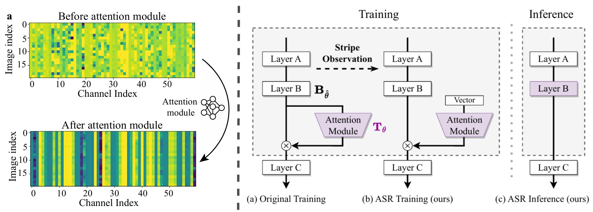

# Stripe Observation Guided Inference Cost-Free Attention Mechanism  

This repository provides the official implementation of **"Stripe Observation Guided Inference Cost-Free Attention Mechanism"** [[paper]](https://www.ecva.net/papers/eccv_2024/papers_ECCV/papers/03451.pdf), accepted at **ECCV 2024**. 

## 🚀 Introduction  

**Structural Re-parameterization (SRP)** is a technique that enhances neural networks **without increasing inference costs**. While existing SRP methods work well with normalizations, convolutions, etc., they struggle with **attention modules** due to their multiplicative nature and input dependency.  

### 🔍 Our Key Insight: **Stripe Observation**  

We discovered a phenomenon where **channel attention values tend to stabilize to constant vectors** during training. Inspired by this, we propose **ASR (Attention-alike SRP)**, which allows attention mechanisms to be re-parameterized like SRP—achieving the benefits of attention without added inference cost.  

<p align="center">
  
  <br>
  <i><b>Left</b>: The phenomenon of Stripe Observation. <b>Right</b>: The architecture of ASR: During training, a learnable vector is used as input to the attention module. At inference time, the attention module is merged into the backbone network.</i>
</p>  


## 🛠️ Getting Started  

We provide an example to train **ResNet164 + ASR (SE)** on **CIFAR-100**, where [SE](https://arxiv.org/pdf/1709.01507) is a typical self-attention module.

### 1️⃣ Install Dependencies  

Ensure you have Python and [PyTorch](http://pytorch.org/) installed. Then, install the required packages:  
```sh
pip install -r requirements.txt
```  

### 2️⃣ Train a Model with ASR  

```sh
python run.py --arch resnet --module senet --use-asr --dataset cifar100 --use-timestamp --gpu-id 0 
```  

#### 🔹 Explanation of Key Arguments  

- `--module`: Specifies the attention module. New modules can be added under [`models/modules`](models/modules).  
- `--use-asr`: Enables ASR to structurally re-parameterize the attention module.  
- `--use-both`: (Optional) Combines **ASR (SE)** and **SE** for further improvement.  

| Models          | Args                                | Top-1 acc. ↑ | Speed (FPS) ↑|
|-----------------|-------------------------------------|--------------|--------------|
| ResNet164       |                                     | 74.10 [[checkpoint](checkpoints/cifar100-resnet164/)]                      | 438          |
| + SE            | --module senet                      | 75.03 [[checkpoint](checkpoints/cifar100-resnet164-senet/)]                | 286          |
| + ASR (SE)      | --module senet --use-asr            | 75.21 [[checkpoint](checkpoints/cifar100-resnet164-senet-asr/)]            | 442          |
| + ASR (SE) + SE | --module senet --use-asr --use-both | 76.23 [[checkpoint](checkpoints/cifar100-resnet164-senet-asr-both/)]       | 289          |

- (**Cost-free**) ASR enhances performance without adding inference cost.
  - Inference speed: ResNet164 + ASR (SE) = ResNet164.
  - Performance: ResNet164 + ASR (SE) ≈ ResNet164 + SE.  
- (**Compatibility**) ASR seamlessly integrates with existing attention modules.


## 🔧 How ASR Works  

The core implementation is in [`models/asr.py`](models/asr.py). We integrate attention into `BatchNorm2d`. 

#### 🔹 **Switching Between Training & Inference**  
This allows the attention module to be removed **at inference time**, making the model as efficient as the original backbone.  

Before training, **enable the computation of attention module**:  
```python
for m in model.modules():
    if hasattr(m, 'switch_to_train'):
        m.switch_to_train()
```  

Before testing, **merge attention module to `BatchNorm2d`**:  
```python
for m in model.modules():
    if hasattr(m, 'switch_to_deploy'):
        m.switch_to_deploy()
```  
If the model is only used for inference, we can remove unnecessary modules using `switch_to_deploy(delete=True)` to accelerate the inference process.


## 📜 Citation  

If you find this work useful, please cite:  
```bibtex
@inproceedings{huang2024stripe,
  title={Stripe Observation Guided Inference Cost-Free Attention Mechanism},
  author={Huang, Zhongzhan and Zhong, Shanshan and Wen, Wushao and Qin, Jinghui and Lin, Liang},
  booktitle={European Conference on Computer Vision},
  pages={90--107},
  year={2024},
  organization={Springer}
}
```  


## 🙌 Acknowledgments  

This project is based on [bearpaw's PyTorch classification framework](https://github.com/bearpaw/pytorch-classification). Many thanks for their clean and simple implementation!  

